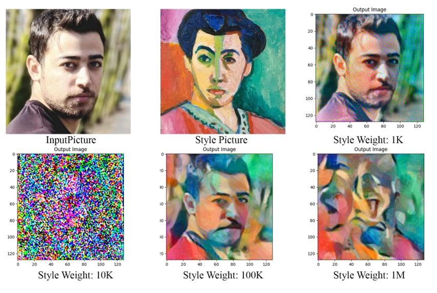

# Style Transfer with VGG19 and ResNet34

## Project Description

This repository contains implementations of style transfer using two different deep-learning architectures: VGG19 and ResNet34. Style transfer is a technique in which the style of one image is applied to the content of another image, resulting in a new image that combines the style of one with the content of the other. The project primarily leverages the work of Alexis Jacq for implementing the style transfer algorithms.

## Contents

1. **VGG19_Style_Transfer.py**: This Python script demonstrates style transfer using the VGG19 architecture. It loads a pre-trained VGG19 model and performs style transfer between a content image and a style image.
   
2. **ResNet34_Style_Transfer.py**: This Python script showcases style transfer using the ResNet34 architecture. It loads a pre-trained ResNet34 model and conducts style transfer between a content image and a style image.
   
3. **Content.jpg**: An example content image used in both style transfer implementations.
   
4. **Style.jpg**: An example style image utilized in both style transfer implementations.

## Implementation Details

- The VGG19_Style_Transfer.py script uses PyTorch and torchvision to load and preprocess images, and it employs VGG19 for feature extraction. It defines content and style losses based on feature maps and gram matrices.
  
- The ResNet34_Style_Transfer.py script employs similar techniques but uses the ResNet34 architecture instead. It extracts features from different layers of the network and calculates style losses based on gram matrices.

## Usage

To use these scripts, ensure you have Python installed along with the necessary dependencies specified in the requirements.txt file. Then, run the scripts using a Python interpreter.

## Requirements

- matplotlib==3.8.2
- numpy==1.23.5
- Pillow==9.5.0
- requests==2.31.0
- torch==2.1.2
- torchvision==0.16.2

## Result Example

## Note

These scripts are provided for educational and demonstration purposes. Users are encouraged to experiment with different images and parameters to achieve desired style transfer effects.

## Disclaimer

This project is not affiliated with the original creators of VGG19 or ResNet34 architectures. The use of pre-trained weights is for demonstration purposes only, and credit is given to the respective authors and contributors of the pre-trained models.
